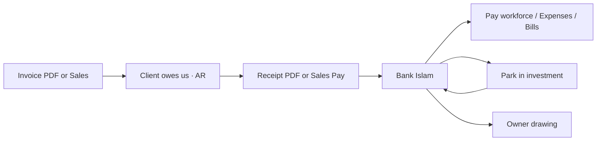

# Smart Ledger Manual

**TEAM CHENDAWAN VENTURES** · Sole proprietorship · Internal finance book

This is the operator guide for Smart Ledger: **when** to open each screen, **why** it exists, and **how** to post the day-to-day work without mixing personal cash, parked investments, and job costs.

---

## Contents

1. [What this book is](#1-what-this-book-is)
2. [Before you start](#2-before-you-start)
3. [How money is recorded](#3-how-money-is-recorded)
4. [Golden rules](#4-golden-rules)
5. [Which screen for which event](#5-which-screen-for-which-event)
6. [Dashboard](#6-dashboard)
7. [Sales (AR)](#7-sales-ar)
8. [Purchases (AP)](#8-purchases-ap)
9. [Pay workforce](#9-pay-workforce)
10. [Expenses](#10-expenses)
11. [Bank & park](#11-bank--park)
12. [Journal](#12-journal)
13. [Reports](#13-reports)
14. [Settings](#14-settings)
15. [Documents that post automatically](#15-documents-that-post-automatically)
16. [Chart of accounts](#16-chart-of-accounts)
17. [Routines](#17-routines)
18. [Worked examples](#18-worked-examples)
19. [Mistakes to avoid](#19-mistakes-to-avoid)
20. [What this ledger does not do](#20-what-this-ledger-does-not-do)

---

## 1. What this book is

Smart Ledger is the company **accounts book** for TEAM CHENDAWAN VENTURES. It sits under **Finance** on the tools hub.

It is a **hybrid accrual** ledger:

| Idea | Meaning in this tool |
| --- | --- |
| Accrual | You record a sale when you **invoice**, not only when cash arrives. You record a bill when you **owe** someone, not only when you pay. |
| Double-entry | Every amount is posted twice: a **debit** and a matching **credit**. The journal will refuse an unbalanced entry. |
| Hybrid | Day-to-day cash (expenses, contractor pay, receipts) still posts straight to **Bank Islam**. You do not have to invent extra steps. |

**Use it to answer**

- How much cash is in Bank Islam right now?
- How much is parked in the investment account?
- Who still owes us (AR)?
- Who we still owe (AP)?
- Did this month make a profit?
- What can go onto the LHDN Form B worksheet?

**Do not use it as**

- A personal wallet
- A client CRM (that is **Clients**)
- A job file (that is **Projects**)
- A staff register (that is **Workforce**)
- A filed tax return (the tax pack is a **worksheet**)

---

## 2. Before you start

### Sign in

1. Open the tools hub and **Sign in**.
2. Open **Smart Ledger**.
3. The first signed-in open creates the chart of accounts, **Bank Islam**, the **investment account**, and the opening capital journal if the books are empty.

Without a signed-in session, nothing will save.

### Keep records first

Posting is cleaner if these exist **before** you invoice or pay people:

| Record | Why the ledger needs it |
| --- | --- |
| **Clients** | Invoices and receipts attach to a client. |
| **Projects** | Document numbers and job profit use the project. |
| **Workforce** | Pay workforce and Payslip / Payment Advice pick a worker. |

### Company bank (operating)

| Field | Value |
| --- | --- |
| Bank | Bank Islam |
| Account name | Saiful Iqbal |
| Account no. | 01050026135751 |
| Role | Default bank for invoices, receipts, expenses, and contractor pay |

Opening capital from the previous job is **RM 380** in Bank Islam. That is equity, not income.

### Investment account (park)

A second asset account is created empty. Put the real product name and account number in **Settings** when you have them. Parking money here does **not** reduce profit.

---

## 3. How money is recorded



### The four buckets

| Bucket | Examples | Hits P&L? |
| --- | --- | --- |
| **Asset** | Bank Islam, investment, unpaid invoices (AR) | No — you still own it |
| **Liability** | Unpaid bills (AP), SST / EPF / SOCSO payable | No — you still owe it |
| **Equity** | Opening capital, owner drawings | No — owner’s capital, not a job cost |
| **Income / expense** | Professional services, contractor cost, software | **Yes** — this is profit or loss |

### Debit and credit in plain language

You do not need to memorise accounting theory. Remember the **story**:

| What happened | What the book does |
| --- | --- |
| Client is billed | Debit AR · Credit Revenue (and SST if any) |
| Client pays | Debit Bank · Credit AR |
| You pay a contractor now | Debit Contractor cost · Credit Bank |
| You owe a contractor later | Debit Contractor cost · Credit AP, then later Debit AP · Credit Bank |
| You park RM 1,000 | Debit Investment · Credit Bank Islam |
| You take money for yourself | Debit Drawings · Credit Bank — **not** an expense |

---

## 4. Golden rules

> **1. Invoice when the work is billable.**  
> Profit is recognised on the invoice date, even if the client has not paid.

> **2. Receipts clear invoices.**  
> Put the invoice number on the Receipt. Cash then reduces AR instead of looking like new income.

> **3. Drawings are not expenses.**  
> Money you take for personal use goes to **Bank & park → Owner drawing**. It must never go on Expenses.

> **4. Parking is not spending.**  
> Moving cash to the investment account only swaps assets. The company is not poorer.

> **5. Employees go through Payslip.**  
> Anyone with EPF / SOCSO / EIS / PCB uses **Payslip / Payment Advice**. Do not use Pay workforce for that.

> **6. Lock a month after you close it.**  
> Settings → Lock a month stops new invoices, payslips, and journals from changing a finished period.

> **7. Fix mistakes with Edit or Void.**  
> Edit an unlocked journal, invoice, bill, or expense. Void posts a reversing journal. Do not post a second “correction” invoice unless you mean a real credit.

> **8. SST stays 0% unless you register.**  
> The company is not SST-registered by default. Leave SST at RM 0 on invoices.

---

## 5. Which screen for which event

| What just happened | Open this | Why |
| --- | --- | --- |
| Finished a job and need to bill | **Invoice Generator**, then check **Sales** | Client PDF + automatic AR and revenue |
| Client paid into Bank Islam | **Receipt Generator** (reference the INV) | Cash in + AR down |
| Need books without a PDF | **Sales** | Manual invoice or collection |
| Supplier invoice you will pay later | **Purchases** | Expense now, AP until you pay |
| Pay a contractor / freelancer today | **Pay workforce** | Cash out + contractor cost |
| Need a payment-advice PDF | **Payslip / Payment Advice** | PDF + ledger in one step |
| Pay an employee with statutory | **Payslip** (employee) | Salary + EPF / SOCSO / EIS / PCB |
| Paid Grab, domain, Canva, petrol now | **Expenses** | Cash out + overhead |
| Move spare cash to investment | **Bank & park** | Asset swap, not P&L |
| Bring parked money back | **Bank & park** | Reverse the park |
| Investment paid a dividend | **Bank & park** (investment selected) | Other income |
| Take owner living money | **Bank & park → Drawing** | Equity, not expense |
| Typo on a posted journal | **Journal** | Edit or void |
| Month-end pack / Form B worksheet | **Reports** | Print or PDF |
| New bank, new GL code, lock August | **Settings** | Structure of the book |

---

## 6. Dashboard

**When:** Every time you open the ledger, and again at month end.

**Why:** A one-screen health check. It does not post anything.

| Tile | What it means | Healthy look |
| --- | --- | --- |
| **Cash in bank** | Bank Islam (and any other operating bank) | Enough to pay bills this week |
| **Invested / parked** | Investment account | Spare cash you chose to park |
| **AR outstanding** | Invoices not fully collected | Follow up anything aging past 30 days |
| **AP outstanding** | Bills not fully paid | Pay before it hurts cash |
| **This month P&L** | Income minus expenses this calendar month | Drawings do **not** reduce this number |

**Where the money sits** lists each account and **Total liquid** (bank + invested).

**Unpaid invoices aging** groups AR into 0–30 / 31–60 / 61–90 / 90+ days.

**Project billed vs costs** uses invoices and expense journals tagged to a project. Use it to see if a job is still profitable **before** you discount the next invoice.

---

## 7. Sales (AR)

**When:** A client owes you, or you need to change / collect an invoice already on the books.

**Why:** Sales is accounts receivable. It is the list of invoices and the cash that clears them.

### Preferred path (with PDF)

1. Create the client and project under **Records**.
2. Open **Invoice Generator**, fill the job, download the PDF.
3. The download **posts the invoice** into Sales automatically:
   - Debit **1100 Accounts receivable**
   - Credit **4000 Professional services**
   - Credit **2100 SST payable** only if SST is not zero
4. When the client pays, open **Receipt Generator**, type the **INV number** as the reference, download the PDF.
5. The receipt posts:
   - Debit **1000 Bank — Bank Islam**
   - Credit **1100 Accounts receivable**

### Manual path (no PDF)

On **Sales**:

1. **Add / edit invoice** — number, dates, client, project, subtotal, SST, total, memo.
2. **Save invoice**.
3. When cash arrives without a receipt PDF, use **Record a collection** or the row **Pay** button.

### Buttons

| Action | Use it when |
| --- | --- |
| **Save invoice** | New manual invoice, or you edited totals / dates / project |
| **Pay** on a row | Client paid; fills the collection form with the remaining balance |
| **Post payment** | Confirm the collection into the chosen bank |
| **Post missing invoices** | An Invoice PDF was issued but never landed in Sales — run this once |

### Statuses

| Status | Meaning |
| --- | --- |
| `issued` | On the books, nothing collected |
| `partial` | Some cash in, balance left |
| `paid` | Balance is zero |
| `void` | Do not edit; reverse via Journal if needed |

**Edit rule:** You cannot make the invoice total smaller than cash already collected.

---

## 8. Purchases (AP)

**When:** Someone billed **you**, and you have not paid yet (or you will pay in parts).

**Why:** The cost hits this month’s P&L immediately. Cash leaves later. That is accrual.

Examples:

- Hosting invoice due next week
- Contractor milestone you accepted but will pay on Friday
- Accountant fee not yet transferred

### Record a bill

1. Date and due date.
2. Amount.
3. **Expense account** — pick the real category (`5000` contractor, `6010` hosting, `6060` professional fees, …).
4. Vendor **or** worker (or type a new vendor name).
5. Project if the cost belongs to a job.
6. Memo — write something you will recognise in three months.
7. **Save bill**.

Journal: Debit the expense · Credit **2000 Accounts payable**.

### Pay a bill

1. Choose the unpaid bill (or click **Pay** on the row).
2. Date, amount (can be a part payment), bank.
3. **Post payment**.

Journal: Debit AP · Credit Bank.

Until you pay, the amount sits in **AP outstanding** on the dashboard.

> If you already paid in the same moment you received the invoice, skip Purchases and use **Expenses** or **Pay workforce** instead. Do not record both.

---

## 9. Pay workforce

**When:** You are transferring company money to a **contractor** or **freelancer** who is already on **Workforce**.

**Why:** This is the fast cash-out for ICA / freelance work. It posts cost and bank in one step.

### How

1. Register the person in **Workforce** first.
2. Open **Pay workforce**.
3. Worker, date, amount, project, bank (defaults to Bank Islam), memo.
4. Leave **Paid now** ticked if the transfer already left (or is leaving) the bank.
5. Untick **Paid now** if you only want an unpaid bill — it will appear under **Purchases**.
6. **Post payment**.

| Worker type | Cost account | Notes |
| --- | --- | --- |
| Independent contractor / freelancer | `5000` Contractor / ICA costs | Normal path for this screen |
| Employee | `5200` Salary expense | Only if there are **no** statutory deductions. Otherwise use **Payslip** |

### Payslip vs Pay workforce

| Need | Tool |
| --- | --- |
| PDF payment advice for a contractor | **Payslip / Payment Advice** (non-employee layout) |
| Cash only, no PDF | **Pay workforce** |
| Employee with EPF / SOCSO / EIS / PCB / HRDF | **Payslip** only |

The Payslip download posts salary or contractor cost, net pay, and statutory payables automatically.

---

## 10. Expenses

**When:** You already paid a company cost from Bank Islam (or another listed bank) **today**.

**Why:** One form: category + cash out. No AP.

Typical items:

- Domain, hosting, software subscriptions
- Marketing ads
- Travel / Grab for a site visit
- Office supplies
- Bank charges
- Insurance

### How

1. Date, amount, **category**, project (if any), bank, memo.
2. **Save expense**.

Journal: Debit the category · Credit Bank.

### Do not put these on Expenses

| Item | Put it here instead |
| --- | --- |
| Owner personal transfer | **Bank & park → Owner drawing** |
| Parking spare cash | **Bank & park → Park or withdraw** |
| Unpaid supplier invoice | **Purchases** |
| Contractor milestone | **Pay workforce** or **Payslip** |
| Client refund of a billed job | **Journal** or reduce / void the invoice — do not expense it as “software” |

---

## 11. Bank & park

**When:** Money moved between company accounts, you took a drawing, you earned an investment return, or you are matching the bank statement.

**Why:** This screen is the **cash story**. It is not the P&L.

### Account picker

| Account | Kind | GL | Use |
| --- | --- | --- | --- |
| Bank Islam | Operating | `1000` | Day-to-day receipts and payments |
| Investment account | Invested | `1010` | Spare cash you parked |

Each account has its own register (in / out / running balance) and a statement box for a simple reconcile.

### Park or withdraw

**Park** — Bank Islam has more cash than you need this month.

1. From: Bank Islam  
2. To: Investment account  
3. Amount and date  
4. **Transfer**

Journal: Debit `1010` · Credit `1000`.  
Dashboard: cash in bank **down**, invested **up**, total liquid **unchanged**, P&L **unchanged**.

**Withdraw** — you need operating cash again. Reverse From / To.

### Investment return

Select the **investment account**, then use **Investment return** when the product pays a dividend or you book a realised profit.

Journal: Debit `1010` · Credit `4100 Other income`.  
That **does** increase P&L.

If the return is paid out in cash to Bank Islam instead of staying invested: record the return on the investment account, then **withdraw** the same amount to Bank Islam — or post a journal if the broker paid Bank Islam directly (Debit `1000` · Credit `4100`).

### Owner drawing

**When:** You transfer company money to yourself for living costs.

**Why:** A sole proprietor does not salary himself through Expenses. Drawings reduce **equity**, not profit. LHDN Form B does not treat drawings as a deductible expense. The tax pack lists them separately.

Journal: Debit `3100 Owner drawings` · Credit Bank.

### Reconcile

Type the statement balance. The difference is ledger vs bank. If it is not zero, a transfer, expense, or receipt is missing or dated wrong.

---

## 12. Journal

**When:** Something does not fit a form, or a posted entry is wrong.

**Why:** The journal is the raw book. Every invoice, bill, expense, transfer, and payslip is already a journal. This screen lets you **edit**, **void**, or post a **manual** pair of lines.

### Edit

Click **Edit** on an unlocked journal (or from a bank register line). Change date, memo, or lines. Debits must still equal credits. A locked month will reject the save.

### Void

**Void** posts a reversing journal. The original stays visible as voided. Source PDFs are **not** deleted. Use this when the whole entry should not have happened.

### Manual journal

Use only when no other screen fits, for example:

- Opening AR/AP brought forward (or use Settings → Opening balance)
- Reclassify an expense to the wrong category
- Bank charge the statement shows that you never entered
- Investment return paid straight into Bank Islam

Always write a memo a stranger could understand.

---

## 13. Reports

**When:** Month end, when a client asks for a statement of job cost, or when you prepare Form B.

**Why:** These are A4 packs with the company header. Download PDF or print. They do not post.

Pick the **month** first. Year-to-date reports still use that month as the end date.

| Report | When | Why |
| --- | --- | --- |
| **Profit & loss** | Every month | Income, direct costs (`5xxx`), overheads (`6xxx`), net profit. Drawings are excluded. |
| **Balance sheet** | Every month | What the company owns (bank, investment, AR) vs owes (AP, statutory) vs equity (capital − drawings + earnings). |
| **Cash movement** | When the bank statement looks “off” | In and out per account, including parks. |
| **AR / AP aging** | Weekly if clients are slow | Who to chase, who to pay. |
| **Project profitability** | After a milestone or before the next quote | Income vs costs tagged to that project. |
| **LHDN tax pack** | Year end / Form B prep | P&L plus drawings called out as **not deductible**, plus SST note. **Worksheet only — not a filed return.** |

Gross profit on the P&L is income minus `5xxx` job costs. Net profit then subtracts `6xxx` overheads.

---

## 14. Settings

**When:** Setup, a new bank product, a new expense category, or closing a month.

### Lock a month

After you have checked P&L, bank, and AR/AP for August, lock `2026-08`.  
Locked months reject new journals, including Invoice and Payslip posts. Unlock only to fix a genuine error, then lock again.

### Bank & investment accounts

| Field | Tip |
| --- | --- |
| Name | Bank Islam, or the real investment product name |
| Kind | **Operating bank** or **Investment (park funds)** |
| Account name / no. | As on the statement |
| GL code | Operating `1000` · Investment `1010`. Each register needs its own asset code. |
| Opening balance | Only for a **new** account that already had money. Opening posts against **Opening capital**. Do not re-enter the RM 380. |

### Chart of accounts

Add a code if a cost does not fit (for example a new overhead `6080`). Do not rename codes that journals already use unless you know the old posts.

### Opening balance journal

Use for AR or AP brought forward from paper books. It posts the account against **3000 Opening capital**.

---

## 15. Documents that post automatically

These tools write the ledger when you **commit / download** the PDF. You should still glance at Sales, Pay workforce, or Journal afterwards.

| Document | Prefix | Ledger effect |
| --- | --- | --- |
| Invoice | `INV` | Issue: Dr AR / Cr Revenue / Cr SST |
| Receipt | `RCP` | Dr Bank / Cr AR if `refInvoice` matches an INV. Extra cash → Other income |
| Payslip (employee) | `PSL` | Salary + employer statutory expenses; net pay and statutory payables |
| Payment advice (contractor) | `PSL` | Contractor cost and net pay (or AP if unpaid) |
| Quotation | `QUO` | **No** ledger post — not a sale yet |
| NDA / MSA / SLA / Privacy / ICA | legal | **No** ledger post — legal paper only |

Number shape:

```text
PREFIX/YEAR/JOB-SERVICE
INV/2026/001-WSD-100/01
PSL/2026/001-ITC-500/01
```

If an invoice PDF exists but Sales is empty, use **Sales → Post missing invoices**.

---

## 16. Chart of accounts

Posting uses **codes**, not display names.

### Assets

| Code | Name | When it moves |
| --- | --- | --- |
| `1000` | Bank — Bank Islam | Receipts, expenses, pay, drawings, parks out |
| `1010` | Investment account | Parks in, withdraws, investment returns |
| `1100` | Accounts receivable | Invoice issue / collection |

### Liabilities

| Code | Name | When it moves |
| --- | --- | --- |
| `2000` | Accounts payable | Unpaid bills and unpaid workforce |
| `2100` | SST payable | Only if you charge SST |
| `2200`–`2240` | EPF / SOCSO / EIS / PCB / HRDF payable | Employee payslips |

### Equity

| Code | Name | When it moves |
| --- | --- | --- |
| `3000` | Opening capital | Seed / brought-forward balances |
| `3100` | Owner drawings | Personal take-out |
| `3900` | Current earnings | Report figure (profit held in equity) |

### Income

| Code | Name | When it moves |
| --- | --- | --- |
| `4000` | Professional services | Invoices |
| `4100` | Other income | Unapplied receipts, investment returns |

### Direct costs (`5xxx` — job / people)

| Code | Name | When to use |
| --- | --- | --- |
| `5000` | Contractor / ICA costs | Contractors and freelancers |
| `5100` | Other project costs | Job costs that are not people |
| `5200` | Salary expense | Employees via Payslip |
| `5300`–`5330` | Employer EPF / SOCSO / EIS / HRDF | Employee payslips |

### Overheads (`6xxx`)

| Code | Name | When to use |
| --- | --- | --- |
| `6000` | Software | Apps, seats, licences |
| `6010` | Hosting | Domains, servers, email |
| `6020` | Marketing | Ads, boosts |
| `6030` | Travel | Grab, fuel, outstation |
| `6040` | Office | Stationery, small tools |
| `6050` | Bank charges | Fees on the statement |
| `6060` | Professional fees | Accountant, lawyer |
| `6070` | Insurance | Business cover |
| `6090` | Miscellaneous | Only if nothing else fits |

---

## 17. Routines

### Every payment day

- [ ] Client paid? **Receipt** with the INV number, or **Sales → Pay**
- [ ] Paid a contractor? **Pay workforce** or **Payslip**
- [ ] Paid a small bill already? **Expenses**
- [ ] Took money for yourself? **Drawing**, not Expenses
- [ ] Parked spare cash? **Bank & park**

### Every week

- [ ] Dashboard: cash, invested, AR, AP
- [ ] Chase invoices in 31–60 days
- [ ] Bank register vs Bank Islam app — difference should be explainable

### Every month

- [ ] All invoices for work done this month are issued
- [ ] All receipts applied to the right INV
- [ ] Expenses and contractor pay tagged to the right **project**
- [ ] **Reports → Profit & loss** and **Balance sheet**
- [ ] **Cash movement** vs statements (Bank Islam + investment)
- [ ] **Settings → Lock** the month

### Every year (Form B season)

- [ ] Unlock nothing unless a real error must be fixed
- [ ] **Reports → LHDN tax pack** for the year
- [ ] Confirm drawings are listed and **not** mixed into expenses
- [ ] Confirm investment parks are assets, not “marketing” or “misc”
- [ ] Hand the worksheet to your tax preparer — this is not the filed return

---

## 18. Worked examples

### A. Bill a website job, then get paid

1. **Projects** — job exists for the client.  
2. **Invoice Generator** — download `INV/2026/001-WSD-100/01`.  
3. Dashboard: AR up, P&L up, cash unchanged.  
4. Client transfers to Bank Islam.  
5. **Receipt Generator** — reference that INV, download.  
6. Dashboard: AR down, cash in bank up. P&L unchanged (the sale was already booked).

### B. Pay an ICA milestone

1. **Workforce** — contractor exists.  
2. **Pay workforce** — amount, project, Bank Islam, paid now.  
3. P&L: contractor cost up. Cash in bank down.  
4. Optional: **Payslip / Payment Advice** if they need a PDF (do not also Pay workforce for the same amount).

### C. Park RM 2,000 you will not need this month

1. **Bank & park** → Park or withdraw.  
2. From Bank Islam → Investment account → RM 2,000.  
3. Cash in bank −2,000. Invested +2,000. Profit unchanged.  
4. Later, withdraw what you need to pay a contractor.

### D. Owner takes RM 500 for personal use

1. **Bank & park → Owner drawing** → RM 500 from Bank Islam.  
2. P&L unchanged. Equity down.  
3. Do **not** book this as Salary or Miscellaneous.

### E. Domain auto-debit RM 45

1. **Expenses** — Hosting `6010`, Bank Islam, memo `Domain renewal`.  
2. If the statement also shows a RM 1 fee, a second expense on `6050 Bank charges`.

### F. Hosting invoice due in 14 days

1. **Purchases** — bill RM 120 on `6010`, due date set.  
2. AP up, P&L already includes the cost.  
3. On payment day, **Pay a bill** from Bank Islam.

---

## 19. Mistakes to avoid

| Mistake | What goes wrong | Fix |
| --- | --- | --- |
| Expense a drawing | Profit looks worse than it is; Form B is wrong | Void the expense; post a drawing |
| Expense a park | Profit looks worse; investment is invisible | Void the expense; transfer Bank → Investment |
| Receipt without INV number | Cash looks like Other income; AR stays high | Edit / void; re-post receipt with the INV |
| Invoice + manual Sales for the same job | Revenue doubles | Void one journal; keep a single INV |
| Pay workforce **and** Payslip for the same pay | Cost doubles | Void one source |
| Pay workforce for an employee with EPF | Statutory missing | Use Payslip |
| Two parks for one real transfer | Investment inflated | Void the extra transfer |
| Unlock and rewrite old months casually | Reports no longer match what you already printed | Lock again after a documented fix |
| Put client money in a personal account and skip the receipt | Books and bank will never match | Receipt into the company Bank Islam path |

---

## 20. What this ledger does not do

These are **out of scope** today. Do not expect the screens to invent them:

- Recurring bills / standing instructions
- MyInvois / e-Invoice submission
- Bank CSV or API import
- File attachments on bills
- Multi-currency
- Automatic EPF / SOCSO tables (you type the figures on the Payslip)
- A filed LHDN return

---

## Quick map

```text
Records          Documents                 Finance
─────────        ─────────                 ────────
Clients    ───►  Invoice  ─── posts ───►   Sales (AR)
Projects   ───►  Receipt  ─── posts ───►   Sales + Bank
Workforce  ───►  Payslip  ─── posts ───►   Journal / Bank
                 Quotation / legal         (no post)

                 Pay now, no PDF  ──────►  Pay workforce
                 Paid small cost  ──────►  Expenses
                 Owe someone      ──────►  Purchases
                 Park / draw      ──────►  Bank & park
                 Close the month  ──────►  Reports + Settings lock
```

Open Smart Ledger from the hub whenever money **moved**, a client **owes**, or you **owe**. If nothing financial happened, you do not need the ledger that day.
